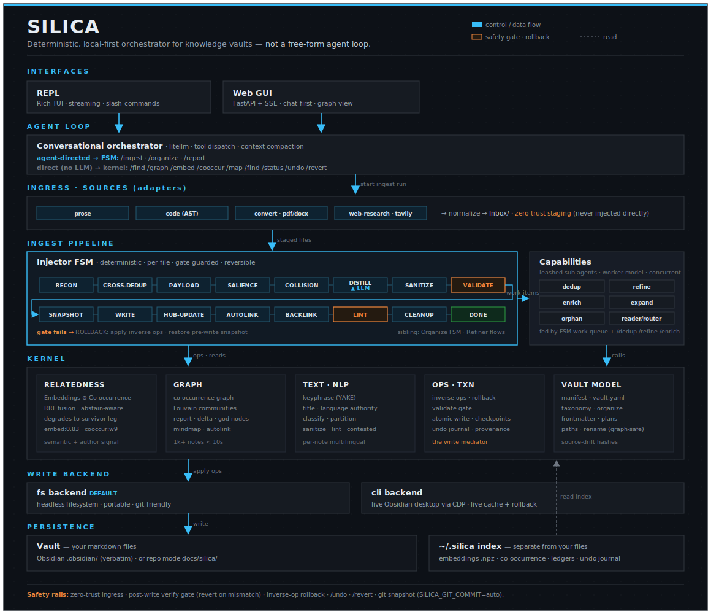

# Silica

[](https://www.python.org/)
[](https://obsidian.md/)
[](https://opensource.org/licenses/AGPL-3.0)
[](https://github.com/astral-sh/uv)

<p align="center">
  
</p>

> **Silica** is an FSM-orchestrated agent for human-readable knowledge vaults, with a deterministic retrieval layer and safety-gated writes: a CLI tool for **safe** curation and organization. Local-first and open-source. Supports Obsidian.

> ⚖️ **License - read this before modifying, distributing, or using this code.** Silica is licensed under **AGPL-3.0-or-later**, a *strong copyleft* license. If you copy any part of this code - even a single function - into your own project, **that entire project must be released under the AGPL-3.0** with complete source available to every user. Under §13 (the network clause) this applies **even if you only run it as a web service** and never distribute a binary. Closed-source or proprietary use of this code is not permitted. See [LICENSE](LICENSE).

---

## Table of Contents
- [Why guardrails, not trust](#why-guardrails-not-trust)
- [Overview](#overview)
- [Git isn't enough](#git-isnt-enough)
- [Design contracts](#design-contracts)
- [What Silica is not](#what-silica-is-not)
- [Use Cases](#use-cases)
- [Quick Start](#quick-start)
  - [Installation](#installation)
  - [Setup](#setup)
  - [Execution](#execution)
  - [REPL Commands](#repl-commands)
- [Configuration](#configuration)
- [Status](#status)
- [Quirks & Features](#quirks--features)
- [References](#references)
- [License](#license)

---

## Why guardrails, not trust

You already let deterministic tools rewrite and reject your work every day. You don't extend them trust; you trust the guardrail. Silica wraps an LLM's edits to your vault in the same kind of guardrail:

| You already let a deterministic tool… | to guard against… | Silica does the same for a vault by… |
| :--- | :--- | :--- |
| a **compiler** reject source that won't build | syntax and type errors | an FSM refusing to commit a note that fails its structural checks |
| a **test suite** block a merge that breaks behavior | regressions | a post-write **verify gate** that reverts any edit which breaks vault coherence |
| **git** roll back a bad commit | losing history | `/undo` and `/revert` rolling back an injection, per-note or per-run |
| a **formatter** rewrite your code without asking | drift and inconsistency | graph-safe refactors that redirect links so a merge or split never orphans a note |

You don't have to believe anything about the model. You only have to believe that compilers and test suites exist, and that the same discipline can wrap a knowledge base.

---

## Overview

<p align="center">
  
</p>

Silica is a CLI-based, FSM-orchestrated agent that manages Obsidian vaults, keeping context of how their pieces relate: co-occurrence, hyperlinks, graph. Codebases, images, and `.pdf`/`.docx`/`.txt` documents are in progress (see [Status](#status)).

- Silica is ***local-first*** (LM Studio, Ollama); OpenRouter is also supported.
- **Silica guards against vault corruption and structural clutter** through safety-hardened tools and layered rollback.
- Silica maintains a vault index **separate from your files**.
- Silica is **not** a free-form agent orchestrator: every write passes through a state machine.

---

## Git isn't enough

`git revert` restores a file's bytes. It cannot see that the edit orphaned a note, broke a wikilink, or created a near-duplicate of a concept you already had, because coherence lives in the *graph between* files, not in any single file's bytes. That's the failure git is blind to, and it's exactly the one Silica's verify gate and graph-safe refactors catch.

So run git *alongside* Silica, not instead of it: git is the byte-level backstop, Silica is the coherence layer on top. Belt and suspenders.

---

## Design contracts

Silica is not a free-form agent. Every vault mutation passes through a finite-state machine that enforces these contracts:

- **Single entry point** - all ingestion flows through the Injector FSM. There is no side channel that writes to the vault.
- **Verify-or-revert** - every write is re-read and checked afterward; a mismatch (`VerifyMismatchError`) rolls the write back.
- **Graph-safe moves** - renames, merges, and splits redirect incoming links atomically. No operation leaves a broken reference or an orphan.
- **Zero-trust ingress** - external content (e.g. web search) can only land in `Inbox/`. Nothing reaches the vault without explicit human staging and FSM review.
- **Layered rollback** - `/undo` (per note), `/revert` (per run), and optional `SILICA_GIT_COMMIT=auto` stack as independent safety nets.

The full schematic (interfaces, agent loop, ingress adapters, the Injector FSM state sequence, the kernel, write backends, and persistence):

<p align="center">
  
</p>

> **Honesty note.** These are enforced *today* by the FSM on the normal write path. They are not yet *crash-verified*: a chaos harness that kills the process mid-write to prove the invariants survive failure is [in progress](#status). Trust the contracts for what they are: enforced control flow, not a formal proof under adversarial faults.

---

## What Silica is not

- **Not a "point AI at your notes" button.** Ingestion keeps a human in the loop: the agent proposes, the FSM gates, you confirm.
- **Not a correctness proof.** "Coherence" is a heuristic target enforced by contracts, not a theorem. Silica shrinks the blast radius of a bad edit; it does not guarantee the edit was *semantically* right.
- **Not a backup.** It runs alongside git and your own backups, never in place of them.
- **Not a free-form orchestrator.** No open-ended tool-calling loop over your vault - the state machine is the only way in.

---

## Use Cases

1. **Automated Inbox Ingestion** - Reads raw clippings and drafts from an inbox directory, distills them into atomic markdown concepts, resolves duplicate matches against the existing vault, and writes them safely.
2. **Conversational Vault Querying** - Query your notes, map paths across the graph, and generate outlines or synthesis documents using semantic search and graph-traversal tools in the REPL.
3. **Graph-Safe Note Refactoring** - Handles complex merges and splits of concept notes, redirecting incoming links automatically to prevent broken references or orphaned files.

---

## Quick Start

### Installation
Clone the repository and install it in editable mode:

```bash
git clone https://github.com/kiycoh/silica-agent.git
cd silica-agent
uv pip install -e .
```

### Setup

Run the interactive wizard - it writes your `.env` (vault, backend, chat provider, embeddings) and finishes with a diagnostic report:

```bash
uv run silica init
```

Re-check the environment at any time:

```bash
uv run silica doctor
```

### Execution

Start the interactive REPL:

```bash
uv run silica
```

A good first move on an existing vault is a read-only structural audit. It never writes, and it shows you the hubs, bridges, and orphans before you touch anything:

```
/report
```

Then run the ingestion pipeline from inside the REPL:

```
/ingest Inbox/note.md --target=Concepts/AI
```

### MCP server (Silica as agent memory)

`silica mcp` serves the vault over stdio to any MCP client — semantic/text search, note reading, and gated single-note writing (12 tools; `--all` exposes the full toolset). For Claude Code the repo is also a plugin: one install wires the MCP server **and** the `silica` skill (the recall-before-answering / capture-after-learning loop):

```bash
claude plugin marketplace add /path/to/silica-agent   # or the GitHub repo
claude plugin install silica@silica
```

To wire only the MCP server, without the skill:

```bash
claude mcp add silica -- uv run --project /path/to/silica-agent --with mcp silica mcp
```

The vault resolves like the REPL: `SILICA_VAULT` if set (add `-e SILICA_VAULT=/path/to/vault` to pin one), else from the client's working directory — a project repo gets its `docs/silica`. Requires the `[mcp]` extra (`uv pip install -e '.[mcp]'`).

### REPL Commands

**Workflow** - agent-directed:

| Command | Usage | Description |
| :--- | :--- | :--- |
| `/report` | `[folder] [--top-k=N] [--embeddings]` | Structural audit of the vault (hubs, bridges, orphans). Pauses for confirmation. |
| `/ingest` | `<file...> [--target=DIR] [--hub=H]` | Bring files in: notes via Injector FSM, code as skeleton stubs |
| `/organize` | `"<intent>" [--scope=FOLDER] [--file=taxonomy.yaml] [--merge] [--move-uncategorized] [--apply]` | Classify and reorganize vault notes according to a taxonomy |

**Direct** - immediate, no LLM round-trip:

| Command | Usage | Description |
| :--- | :--- | :--- |
| `/status` | `[run_id]` | Progress digest of the last run |
| `/convert` | `<file...> [--target=DIR]` | Transcode a non-`.md` file (PDF) into a markdown note in the inbox |
| `/web-search` | `"<concept>" [--max-searches=N]` | Research a concept on the web → cited findings note in the Inbox (then `/ingest`) |
| `/embed` | `[folder] [--force]` | Build/update the embedding index |
| `/cooccur` | `[folder] [--force]` | Build/update the co-occurrence index (no embedder needed) |
| `/graph` | `[out.html] [folder]` | Export the knowledge graph |
| `/map` | `<nota> [--force]` | Radial mind-map rooted on a note → `maps/<stem>.canvas` |
| `/find` | `<query> [--k=N]` | Semantic search |
| `/undo` | `[note-path]` | Undo the last patch on a note |
| `/review` | `[--flush=HASH]` | Inspect the async review queue (deferred ops) |
| `/revert` | `[run-id]` | Revert a whole injection (per-run, LIFO) |
| `/dedup` | `[folder]` | Deduplicate notes (sub-agent) |
| `/curate` | `[folder] [--apply]` | Curate the vault: plan autolink/orphan/dedup/refine work (dry-run; `--apply` executes) |
| `/refine` | `[folder]` | Enrich and normalize notes (sub-agent) |
| `/enrich` | `[folder]` | Enrich note semantics (sub-agent) |
| `/stale [--all]` | | List notes whose `documents:` sources changed structurally since `code_ref` (`--all` includes cosmetic body-only changes) |
| `/plans` | | List `plans/` notes grouped by `status:` |

**System:** `/help` · `/model` · `/tools` · `/clear` · `/verbose` · `/thinking` · `/vault [path]` (show or switch the active vault for this session) · `/exit`

---

## Configuration

Configure the agent via environment variables (e.g., in a `.env` file). `silica init` writes the essentials for you; the full list with defaults lives in [`.env.example`](.env.example).

| Variable | Description |
| :--- | :--- |
| `SILICA_MODEL` | Chat LLM model identifier (litellm format, e.g. `openrouter/anthropic/claude-sonnet-4-20250514`) |
| `SILICA_PROVIDER` | Chat provider preset: `lmstudio` or `openrouter` |
| `OPENROUTER_API_KEY` | Required when the provider is `openrouter` |
| `SILICA_VAULT` | Vault path. An Obsidian vault (`.obsidian/`) is used verbatim; any other path is repo mode → `docs/silica/` |
| `SILICA_BACKEND` | `fs` (headless filesystem, default) or `cli` (live Obsidian desktop via CDP; adds rollback + live cache) |
| `SILICA_EMBEDDING_MODEL` | Embedding model identifier used for semantic tasks (default: `qwen3-embedding-4b`) |
| `SILICA_WORKER_MODEL` | Sub-agent worker model (e.g., a small local model for dedup / refinement) |
| `SILICA_GIT_COMMIT` | Git commit safety net for vault writes (`off`, `auto`) |
| `SILICA_TAVILY_API_KEY` | API key for Tavily search (enables the `/web-search` command) |

---

## Status

Silica is under active development. This is where it honestly stands:

- **Available now** - Obsidian vault ingestion (notes), structural audit (`/report`), semantic (`/find`) and embedder-free co-occurrence search, graph-safe refactor / dedup / merge, git safety net, layered `/undo` and `/revert`, the MCP server (`silica mcp`) with the Claude Code plugin packaging.
- **In progress** - codebase ingestion (skeleton stubs today), PDF/DOCX/TXT ingestion, the live Obsidian bridge (`silica connect`, feature-complete but pending end-to-end hardening), and the crash/chaos harness backing the [design contracts](#design-contracts).
- **Planned** - image ingestion and MCP/skill packaging for non-Claude coding agents.

Distinguish carefully: what ships today is enforced; what's listed above as in-progress or planned is not yet present.

---

## Quirks & Features

* **Token-Efficient Vault Auditing (`/report`)** - Computes community-detection clusters (Louvain modularity), god-nodes (high-degree hubs), structural bridges (inter-community connectors), and orphans, then builds a full structural remediation plan for a vault of **1,000+ markdown files in under 10 seconds**.
* **Parallel Worker Sub-Agents** - Cognitive-heavy batch operations like semantic deduplication (`/dedup`) and detail refinement (`/refine`, `/enrich`) are offloaded to leashed sub-agents. These run concurrently (up to `SILICA_SUBAGENT_MAX_CONCURRENT`) on a separate worker model (`SILICA_WORKER_MODEL`), keeping the main model's context window clean.
* **Embedder-Free Concept Modeling** - If an embedding model is offline or unconfigured, concept matching degrades gracefully to a deterministic, local co-occurrence graph (`/cooccur`) - querying relatedness and labeling communities in `/graph` exports with no network calls or LLM queries.

---

## References

*   **[From Agent Loops to Structured Graphs: A Scheduler-Theoretic Framework for LLM Agent Execution](https://arxiv.org/abs/2604.11378)** (arXiv:2604.11378, 2026)
*   **[Goal-Autopilot: A Verifiable Anti-Fabrication Firewall for Unattended Long-Horizon Agents](https://arxiv.org/abs/2606.11688)** (arXiv:2606.11688, 2026)
*   **[Is Your Agent Playing Dead? Deployed LLM Agents Exhibit Constraint-Evasive Fabrication and Thanatosis](https://arxiv.org/abs/2606.14831)** (arXiv:2606.14831, 2026)
*   **[Reliable Graph-RAG for Codebases: AST-Derived Graphs vs LLM-Extracted Knowledge Graphs](https://arxiv.org/abs/2601.08773)** (arXiv:2601.08773, 2026)
*   **[Predicting new research directions in materials science using large language models and concept graphs](https://doi.org/10.1038/s42256-026-01206-y)** (*Nature Machine Intelligence*, 2026)

Silica's embedder-free near-duplicate detection (`/dedup`) is inspired by and ports the well-thought-out MinHash design from [Graphify](https://github.com/safishamsi/graphify).

---

## License

This project is licensed under the **GNU Affero General Public License v3.0** (AGPL-3.0-or-later).
Copyright (C) 2026 Alessandro Carosia.

AGPL-3.0 is a **strong copyleft** license. In practice, if you incorporate any portion of Silica -
whole modules or individual functions - into another work:

- that work becomes a *derivative* and **must itself be licensed under AGPL-3.0**;
- its **complete corresponding source** must be offered to everyone who uses it;
- **§13** extends this to network use: running a modified version as a hosted service obliges you to
  provide that source to your users, even without distributing any binary.

There is no permissive fallback. If your project cannot comply with these terms, you do not have a
license to use this code. Every source file carries an `SPDX-License-Identifier: AGPL-3.0-or-later`
header; removing it does not remove the obligation.

See [LICENSE](LICENSE) for the full text.
