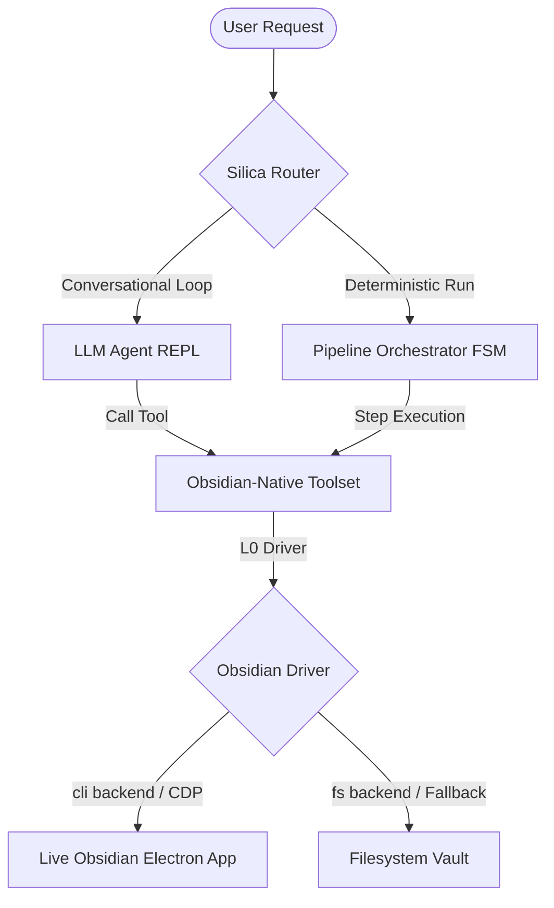

# Silica Agent 🪨

[](https://www.python.org/)
[](https://obsidian.md/)
[](https://opensource.org/licenses/MIT)
[](https://github.com/astral-sh/uv)

> **Silica** is a conversational CLI agent and automated curation engine designed from the ground up to be **Obsidian-native**. It operates directly on your knowledge base, managing daily logs, linking notes, and structuring concepts while preserving vault integrity through strict, deterministic quality gates.

---

## Table of Contents
- [🌟 Overview](#-overview)
- [🎯 Who is Silica for?](#-who-is-silica-for)
- [⚡ How Silica Distinguishes Itself](#-how-silica-distinguishes-itself)
- [🏗️ Layered Architecture (L0–L4)](#%EF%B8%8F-layered-architecture-l0l4)
- [🔍 The Dual-Consumer Paradigm](#-the-dual-consumer-paradigm)
- [📜 The Golden Rules of Curation](#-the-golden-rules-of-curation)
- [⚙️ Configuration](#%EF%B8%8F-configuration)
- [🚀 Quick Start](#-quick-start)
  - [CLI Slash Commands](#cli-slash-commands)
  - [Obsidian-Native Composed Tools](#obsidian-native-composed-tools)
- [📂 Directory Structure](#-directory-structure)
- [⚖️ License](#%EF%B8%8F-license)

---

## 🌟 Overview

At its core, **Silica** addresses a fundamental challenge in agentic AI: *how do we let large language models organize, refactor, and enrich our personal knowledge bases without risking data corruption or structural chaos?*

Instead of treating the vault as a raw, unstructured directory of markdown files, Silica communicates directly with Obsidian. It reads live metadata caches, resolves wiki-links, audits graph structures, and applies modifications via wrapped, safety-hardened tools.



---

## 🎯 Who is Silica for?

Silica is tailored for power users who treat their notes as an external brain:

*   **PKM (Personal Knowledge Management) Practitioners:** Scholars, researchers, and writers who use Obsidian as a semantic web and need automated help sorting their daily inbox.
*   **Safety-First Note Takers:** Users who want to automate tedious chores (formatting metadata, resolving tags, deduplicating notes) but demand guaranteed non-regression and transaction rollbacks.
*   **AI Curation Enthusiasts:** Anyone looking to integrate LLMs into complex workflows where accuracy, facts density, and strict Markdown compliance are non-negotiable.

---

## ⚡ How Silica Distinguishes Itself

While other plugins and tools act as simple, human-in-the-loop chat interfaces, Silica is a **production-grade curation engine with mathematical gates** built for unattended execution.

### 1. Dual-Consumer Architecture
Silica decouples conversational freedom from pipeline safety. The same underlying Obsidian toolset is shared by two distinct execution modes:
*   **The Conversational REPL:** A high-freedom agent that reasons, searches, and interacts with notes on the fly.
*   **Deterministic FSM Pipelines:** Zero-freedom state machines (like the *Injector* or *Refiner*) that process batches using fixed recipes, strict validation gates, and automatic rollbacks.

### 2. Live Graph Safety & Non-Regression
Silica does not just edit text; it protects the graph.
*   **Graph Diffing & Gates:** Silica snapshots the vault graph before running changes. The LINT stage enforces a mathematical non-regression gate:
    *   *Unplanned Orphans:* Rejects if new orphan notes are created (unless explicitly created by the current batch).
    *   *New Unresolved Links:* Rejects if new unresolved links are introduced from pre-existing notes (excluding intentional forward references between newly written notes).
    *   *No Broken Backlinks:* Rejects if incoming link counts decrease for pre-existing notes.
*   **Prospective Link Validation:** During validation, Silica verifies that patch or overwrite operations do not introduce unresolved wikilinks that cannot be found either in the current vault or inside the current batch's write operations.
*   **Robust Transaction Rollbacks:** Before applying edits, Silica builds a transaction log. If any gate fails, the system executes an immediate, atomic rollback using captured `InverseOp` records containing the exact prior note content to revert changes reliably.
*   **The Golden Fallback Oracle:** The dual-backend system includes a live `cli` backend (bridged directly to Electron's live cache for graph-safe updates) and an `fs` backend (direct disk interaction). The `fs` backend serves as a "golden reference" against which the live CLI is continuously validated.

### 3. Safety-Hardened Wrapped Tools
Instead of relying on prompt instructions (e.g., *"never delete notes"*), Silica hardcodes invariants into the tool execution layer itself. For example, `silica_move` natively handles internal links redirection so that links never break, and `silica_delete` enforces strict anti-deletion policies.

### 4. Convergence & Loop Guards
To prevent conversational agent runs from spinning into infinite loops, the agentic loop implements a strict convergence guard. It aborts the execution run and marks the active task as `blocked` in the execution ledger if any tool call with identical arguments fails 3 times consecutively.

### 5. Semantic Deduplication & Collision Routing
During ingestion, Silica utilizes cosine similarity of note embeddings (with $\tau_{\text{high}}$ and $\tau_{\text{low}}$ thresholds) to automatically route concepts:
*   *Strong Duplicate ($\ge \tau_{\text{high}}$):* Automatically routes as a `patch` operation on the existing note.
*   *Ambiguous/Borderline ($\tau_{\text{low}} < \text{score} < \tau_{\text{high}}$):* Saved to a content-hashed **Deferred Store** to prevent cluttering the vault.
*   *Clearly New ($\le \tau_{\text{low}}$):* Promoted to a new concept write operation.

### 6. Deterministic Wikilink Injection (Autolinking)
Silica implements a state-of-the-art autolinker that scans touched notes and wraps the first occurrence of existing vault titles with wikilinks `[[Title]]`. It ensures graph safety by only linking existing titles, respects strict markdown skip regions (yaml frontmatter, code blocks, math, headings, comments), prevents self-linking, and sorts targets longest-first to prevent shadowing.

### 7. Interactive Graph Visualization
Silica includes a built-in graph exporter that generates a fully interactive, offline-capable `vis.js` visualization of your knowledge graph. It runs Louvain community detection algorithms on resolved edges to cluster notes into thematic modules/clusters.

### 8. Progress Tracking & Execution Resumption
Every FSM run writes a `TaskLedger` (immutable plan) and updates a `ProgressLedger` (mutable run-state) under `~/.silica/runs/<run_id>/`. This enables:
*   *Content-addressed Idempotency:* Skipping expensive LLM distillation steps if a chunk has already been successfully processed.
*   *Digest Summaries:* Injecting compact, token-efficient summaries of execution progress into the LLM context.

---

## 🏗️ Layered Architecture (L0–L4)

Silica is organized into five decoupled layers, mapping directly from low-level I/O to high-level declarative workflows:

| Layer | Component | Description |
| :--- | :--- | :--- |
| **L4** | **Recipes** | Declarative YAML files (e.g., `injector.yaml`, `refiner.yaml`) defining the routing stages of curation pipelines. |
| **L3** | **Router / Orchestrator** | Deterministic Finite State Machine that drives recipes, validates gates, and manages snapshot/rollback cycles. Backed by `ProgressLedger` execution state trackers. |
| **L2** | **Worker Semantics** | Stateless, LLM-based sub-agents (e.g., *Distiller*, *Merger*) that execute complex Chain-of-Thought tasks and return structured JSON operations. |
| **L1** | **Mechanical Kernel** | Pure, deterministic Python logic for parsing frontmatter, calculating partitions, running linters, wikilink injection (autolink), candidate generation (EmbedStore), and graph export. No LLMs here. |
| **L0** | **Obsidian Driver** | The unified, domain-specific I/O protocol. Houses the primary `cli` adapter (bridges the live Obsidian desktop app via a CDP interface) and the `fs` fallback database. |

---

## 🔍 The Dual-Consumer Paradigm

The core design guarantees that conversational flexibility and structured pipelines never compromise each other:

| Feature | Conversational Loop (`silica`) | Critical FSM Pipelines (e.g., Ingestion) |
| :--- | :--- | :--- |
| **Control** | LLM-in-the-loop, high autonomy | Finite State Machine, zero autonomy |
| **Determinism** | Non-deterministic | Fully deterministic & reproducible |
| **Human Presence** | Human-in-the-loop | Unattended / Background cron |
| **Guarantees** | Best-effort | Validation gates + automatic rollback |
| **Example Goal** | *"Clean up my notes on neural networks"* | Run the `injector` recipe on incoming PDF payload |

---

## 📜 The Golden Rules of Curation

Every operation applied by Silica adheres to the following system-wide rules:

1.  **Anti-Deletion Policy:** Never silently delete content. Prefer appending, merging, or refactoring.
2.  **Modular Atomicity (Hub-and-Spoke):** Notes should represent single atomic concepts (typically under 40 lines or 6,000 characters), linked back to a central `[[Hub]]`.
3.  **Obsidian-Flavored Markdown (OFM):** Strict usage of callouts (`> [!tip]`), block refs (`^id`), Mermaid diagrams, and LaTeX math blocks.
4.  **Factual Density:** Focus on extracting raw definitions, formulas, and visual examples rather than writing generic summaries.
5.  **AI Tracking:** Automatically tags new or updated notes with `ai_generated: true` in the frontmatter.
6.  **Tag Normalization:** All tags are forced to lowercase with hyphens (e.g., `#machine-learning` instead of `#MachineLearning`).

---

## ⚙️ Configuration

Silica is configured via environment variables or a `.env` file loaded at startup:

| Environment Variable | Config Field | Default | Description |
| :--- | :--- | :--- | :--- |
| `SILICA_PROVIDER` | `provider` | `lmstudio` | Chat LLM provider name (`lmstudio`, `openai`, `openrouter`, etc.) |
| `SILICA_MODEL` | `model` | `""` | Chat LLM model name |
| `SILICA_EMBEDDING_MODEL` | `embedding_model` | `qwen3-embedding-8b` | Embedding model name |
| `SILICA_EMBEDDING_BASE_URL` | `embedding_base_url` | `http://localhost:1234/v1` | Base URL for embedding API endpoint |
| `SILICA_EMBEDDING_API_KEY` | `embedding_api_key` | `lm-studio` | API key for embedding endpoint |
| `SILICA_SIM_THRESHOLD_HIGH` | `sim_threshold_high` | `0.85` | Cosine similarity threshold for strong duplicates (routes to patch) |
| `SILICA_SIM_THRESHOLD_LOW` | `sim_threshold_low` | `0.65` | Cosine similarity threshold for new concepts (routes to write) |
| `SILICA_BANNER_STYLE` | `banner_style` | `wordmark` | CLI startup banner style (`wordmark`, `minimal`) |
| `SILICA_BANNER_FONT` | `banner_font` | `slant` | ASCII font for the wordmark style |
| `SILICA_DEBUG_LOGGING` | `debug_logging` | `False` | Enable verbose debugging logs |

---

## 🚀 Quick Start

### Prerequisites
*   Python 3.11+
*   [uv](https://github.com/astral-sh/uv) (recommended package installer)
*   For the primary `cli` backend: Obsidian Desktop App (running live)

### Installation
Clone the repository and install it in editable mode:

```bash
# Clone the repository
git clone https://github.com/kiycoh/silica-agent.git
cd silica-agent

# Install dependencies and project in editable mode
uv pip install -e .
```

### Running the Agent
Start the interactive conversational REPL session:

```bash
uv run silica
```

For background pipeline runs (e.g., executing the injector recipe):

```bash
# Example command executing the ingestion pipeline directly
uv run python -m silica.router.orchestrator --recipe injector --inbox ./inbox
```

---

### CLI Slash Commands

When inside the conversational REPL, the following slash commands are available:

*   `/clear` — Clears the terminal screen, resets the model message history back to the system prompt, and initializes a clean interactive session.
*   `/verbose` — Cycles through tool progress display levels: `off` → `new` → `all` → `verbose`. The `verbose` mode activates system `DEBUG` logging with a customized, human-friendly formatting wrapper.
*   `/thinking` — Toggles the rendering of the LLM's reasoning and thought blocks.
*   `/model` — Shows the currently active LLM model.
*   `/tools` — Lists all registered Obsidian-native tools.
*   `/help` — Displays the slash command help menu.
*   `/exit` or `/quit` — Exists the conversational session.

---

### Obsidian-Native Composed Tools

Silica exposes composed mechanical workflows as system tools that can be executed directly by the conversational agent or in automated scripts:

*   **`silica_recon`**: Mechanical extraction of concepts from an inbox file and collision analysis against existing vault notes.
*   **`silica_payload`**: Pre-extracts snippets from the vault to build structured context payloads for LLM workers.
*   **`silica_sanitize`**: Cleans, parses, and normalizes operations returned by workers (e.g. strips `.md` from wikilinks).
*   **`silica_validate_ops`**: Pre-write gate validating path slugification, tags, and prospective link resolution.
*   **`silica_bulk_write`**: Batches write/patch/overwrite/delete note operations into the vault.
*   **`silica_lint`**: Post-write gate executing the OFM linter to find structural formatting or graph regressions.
*   **`silica_run_injector`**: FSM entry-point executing the full Injector pipeline end-to-end with transaction rollback.
*   **`silica_autolink`**: Automatically scans note bodies to link existing vault titles while avoiding skip zones.
*   **`silica_embed_refresh`**: Incrementally populates or refreshes the vault embedding index at `~/.silica/index/embeddings.json`.
*   **`silica_semantic_search`**: Queries the embedding store to locate semantically similar vault concepts.
*   **`silica_similar`**: Helper to query similarity matching for arbitrary text blocks or paragraphs.
*   **`silica_graph_export`**: Exports the note graph using Louvain community detection to a self-contained vis.js HTML dashboard.
*   **`silica_ledger_digest`**: Generates a compact summary of a run's plan and execution status.
*   **`silica_deferred_retry`**: Re-evaluates and retries applying deferred operation bundles from the Deferred Store.

---

## 📂 Directory Structure

```
silica-agent/
├── pyproject.toml              # Dependencies & entry points
├── docs/                       # Core architectural charters and review notes
│   ├── SILICA.md               # Original project foundation charter
│   └── ...                     
├── silica/
│   ├── cli.py                  # TUI / REPL CLI entry point
│   ├── agent/                  # Agent loop, LLM call abstractions, & delegate worker pool
│   ├── driver/                 # L0: Obsidian I/O driver (CDP CLI & FS backends)
│   ├── kernel/                 # L1: Pure mechanical modules (linter, parser, graph diff, autolink, embed, graph_export)
│   ├── planner/                # L3: Execution state tracking (TaskLedger & ProgressLedger)
│   ├── router/                 # L3: FSM recipe orchestrator
│   ├── recipes/                # L4: YAML-defined pipeline flows
│   ├── tools/                  # Atomic, composed, and wrapped vault tools
│   └── workers/                # L2: Stateless semantic sub-agents (Distiller prompts & logic)
└── tests/                      # System integration tests & regression golden tests
```

---

## ⚖️ License

Distributed under the MIT License. See [LICENSE](LICENSE) for more information.
