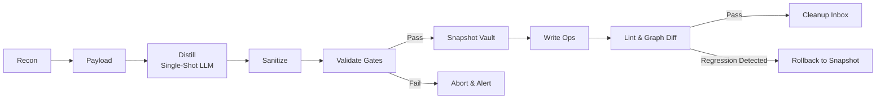
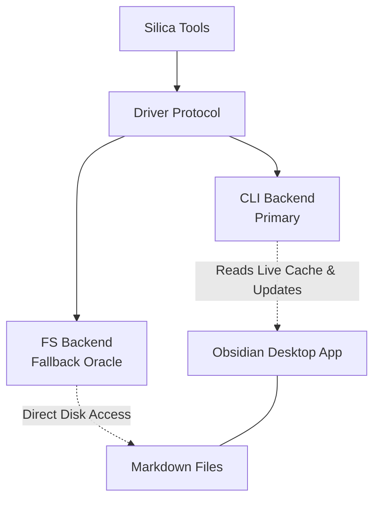

# Silica Agent

[](https://www.python.org/)
[](https://obsidian.md/)
[](https://opensource.org/licenses/Apache-2.0)
[](https://github.com/astral-sh/uv)

> **Silica** is a conversational CLI agent and automated curation engine designed to be **Obsidian-native**. It operates directly on your knowledge base, managing logs, linking notes, and structuring concepts while preserving vault integrity through strict quality gates.

---

## Table of Contents
- [System Overview](#system-overview)
- [Target Audience](#target-audience)
- [Architecture](#architecture)
- [Use Cases](#use-cases)
- [Configuration](#configuration)
- [Quick Start](#quick-start)
  - [REPL Commands](#repl-commands)
  - [System Tools](#system-tools)
- [Directory Structure](#directory-structure)
- [Engineering Decisions and Trade-offs](#engineering-decisions-and-trade-offs)
- [License](#license)

---

## System Overview

Silica manages personal knowledge bases (Obsidian vaults) using agentic LLMs. It addresses the risk of vault corruption and structural chaos by using safety-hardened tools, strict validation gates, and transaction rollbacks. Instead of direct, unstructured filesystem edits, Silica interacts with the Obsidian desktop app's live cache to resolve links, query metadata, and audit vault graph structures.

---

## Target Audience

Silica is designed for:
* **Knowledge Management Practitioners:** Users who leverage Obsidian as a semantic network and need automated assistance sorting daily inputs.
* **Safety-First Automators:** Users requiring automated vault operations (metadata alignment, tag normalization, link resolution) with guaranteed non-regression.
* **AI Curation Engineers:** Developers exploring LLM-based structured workflows where markdown compliance and graph schema validation are mandatory.

> [!NOTE]
> ### Key Technical Differentiators
> * **Graph Validation Gates:** Intercepts write operations to ensure no broken backlinks, unresolved links, or unplanned orphan notes are introduced.
> * **Transactional Rollbacks:** Captures prior states to execute atomicity-preserving rollbacks (`InverseOp`) if post-write validation fails.
> * **Dual-Backend Access:** Primary interaction runs through Obsidian's Chrome DevTools Protocol (CDP) CLI for live cache synchronization, with local filesystem (`fs`) fallback.
> * **Semantic Deduplication:** Uses cosine similarity of embeddings ($\tau_{\text{high}}$ / $\tau_{\text{low}}$) to automatically route new concepts, patch existing notes, or redirect borderline collisions to a deferred queue.
> * **Deterministic Autolinking:** Identifies vault note title mentions in newly written text and wraps them in wikilinks (`[[Title]]`), bypassing code blocks, frontmatter, and mathematical formulas.
> * **Execution Ledgers:** Logs step completion state in a progress ledger, enabling resume-on-failure and content-addressed step caching.

---

## Architecture

Silica is structured in a five-layer stack (L0 to L4) from low-level application drivers to high-level declarative workflows. The architecture coordinates two execution paradigms over a shared core toolset. For a deep-dive breakdown, flow diagrams, and codebase directory topology, see [docs/silica_architecture.md](docs/silica_architecture.md).

### System Layers (L0–L4)

| Layer | Component | Technical Role |
| :--- | :--- | :--- |
| **L4** | **Recipes** | Declarative YAML specifications (e.g., `injector.yaml`) defining stages of the pipeline. |
| **L3** | **Orchestrator** | Deterministic Finite State Machine (FSM) executing recipes, handling state transitions, and tracking progress. |
| **L2** | **Semantic Workers** | Stateless LLM workers (e.g., *Distiller*, *Merger*) executing cognitive reasoning to generate structured JSON patch/write operations. |
| **L1** | **Mechanical Kernel** | Deterministic libraries for parsing frontmatter, resolving wikilinks, generating embeddings, and validating graph diffs. |
| **L0** | **Obsidian Driver** | I/O interface exposing both a CDP-based adapter for the live desktop application and a filesystem fallback. |

### Execution Models

The underlying toolset is accessed via two distinct execution flows depending on the level of autonomy required:

* **Conversational Agent (REPL):** A high-autonomy LLM loop designed for interactive note discovery and ad-hoc operations. Runs step-by-step reasoning but is bound by mechanical invariants embedded directly inside the Python tools.
* **Deterministic Pipelines (FSM):** Zero-autonomy state machines executing fixed recipes (e.g., importing/injecting new materials). Applies strict validation gates (orphan checks, unresolved link checks, backlink counts) and automatically executes rollbacks if gates fail.

### System Topology


### Pipeline Execution Flow



### I/O Driver Architecture



---

## Use Cases

1. **Automated Inbox Ingestion**
   Reads raw clippings and drafts from an inbox directory, distills them into atomic markdown concepts, resolves duplicate matches against the existing vault, and writes them safely.
2. **Conversational Vault Querying**
   Allows users to query their notes, map paths across the graph, and generate outlines or synthesis documents using semantic search and graph-traversal tools in the REPL.
3. **Graph-Safe Note Refactoring**
   Handles complex merges and splits of concept notes. Redirects incoming links automatically to prevent broken references or orphaned files.

---

## Configuration

Configure the agent via environment variables (e.g., in a `.env` file):

| Variable | Default | Description |
| :--- | :--- | :--- |
| `SILICA_PROVIDER` | `lmstudio` | LLM API provider (`lmstudio`, `openai`, `openrouter`, etc.) |
| `SILICA_MODEL` | `""` | Chat LLM model identifier |
| `SILICA_EMBEDDING_MODEL` | `qwen3-embedding-8b` | Embedding model identifier |
| `SILICA_EMBEDDING_BASE_URL` | `http://localhost:1234/v1` | Embedding API endpoint |
| `SILICA_EMBEDDING_API_KEY` | `lm-studio` | Embedding API key |
| `SILICA_SIM_THRESHOLD_HIGH` | `0.85` | Similarity threshold for merging/patching notes |
| `SILICA_SIM_THRESHOLD_LOW` | `0.65` | Similarity threshold for creating new notes |
| `SILICA_BANNER_STYLE` | `wordmark` | CLI banner format (`wordmark`, `minimal`) |
| `SILICA_DEBUG_LOGGING` | `False` | Enables verbose debug outputs |

---

## Quick Start

### Installation
Clone the repository and install it in editable mode:

```bash
git clone https://github.com/kiycoh/silica-agent.git
cd silica-agent
uv pip install -e .
```

### Execution
To start the interactive REPL:

```bash
uv run silica
```

To run a pipeline recipe directly (e.g., ingestion):

```bash
uv run python -m silica.router.orchestrator --recipe injector --inbox ./inbox
```

### REPL Commands
When running the interactive session, the following slash commands are available:
* `/clear` — Clears terminal state and resets session history.
* `/verbose` — Toggles verbose output and debug logging level.
* `/thinking` — Toggles display of reasoning blocks.
* `/model` — Displays the active LLM.
* `/tools` — Lists registered Obsidian tools.
* `/help` — Displays command help.
* `/exit` or `/quit` — Exits the session.

### System Tools
* **`silica_run_injector`**: Runs the end-to-end ingestion pipeline with transaction rollbacks.
* **`silica_recon` / `silica_payload` / `silica_sanitize`**: Pipeline stages for ingestion, payload extraction, and response normalization.
* **`silica_validate_ops` / `silica_bulk_write` / `silica_lint`**: Validation, atomic batch writes, and post-write regression checks.
* **`silica_autolink`**: Automatically inserts wikilinks for matching note titles.
* **`silica_embed_refresh` / `silica_semantic_search`**: Updates and queries the vault's vector database.
* **`silica_graph_export`**: Visualizes the vault network using Louvain modularity clustering.

---

## Directory Structure

```
silica-agent/
├── pyproject.toml              # Dependencies & entry points
├── docs/                       # Project design charters
├── silica/
│   ├── cli.py                  # CLI / REPL interface entry point
│   ├── agent/                  # LLM integration and REPL agent loop
│   ├── driver/                 # L0: Obsidian bridge and filesystem driver
│   ├── kernel/                 # L1: Deterministic parsers, linters, and autolinkers
│   ├── planner/                # L3: Task and progress trackers
│   ├── router/                 # L3: FSM recipe runner
│   ├── recipes/                # L4: YAML pipeline blueprints
│   ├── tools/                  # Registered composed tools
│   └── workers/                # L2: Cogitative prompts and workers
└── tests/                      # Testing suite
```

---

## Engineering Decisions and Trade-offs

We maintain a set of structural patterns and trade-offs documented as Architecture Decision Records (ADRs):

> [!WARNING]
> **ADR-001: Obsidian CLI Primary Driver (vs. Pure Filesystem)**
> We interface with Obsidian's live application cache via a Chrome DevTools Protocol (CDP) client rather than editing raw files directly. This requires the Obsidian desktop app to be running, but guarantees 100% graph safety. The workaround is to use the filesystem backend (`SILICA_BACKEND=fs`) for headless execution.

> [!NOTE]
> **ADR-002: Hardcoded Code Invariants (vs. System Prompts)**
> Safety parameters (e.g., delete prevention, link verification) are hardcoded inside the Python codebase rather than relying on LLM instructions. This eliminates risk from LLM hallucinations.

> [!CAUTION]
> **ADR-007: Isolated LLM Workers**
> Cognitive workers receive static content payloads and output structured JSON operations. They cannot query or modify the filesystem directly, preventing runaway API loops.

---

## License

This project is licensed under the **Apache License 2.0**.

See [LICENSE](LICENSE) for details.
