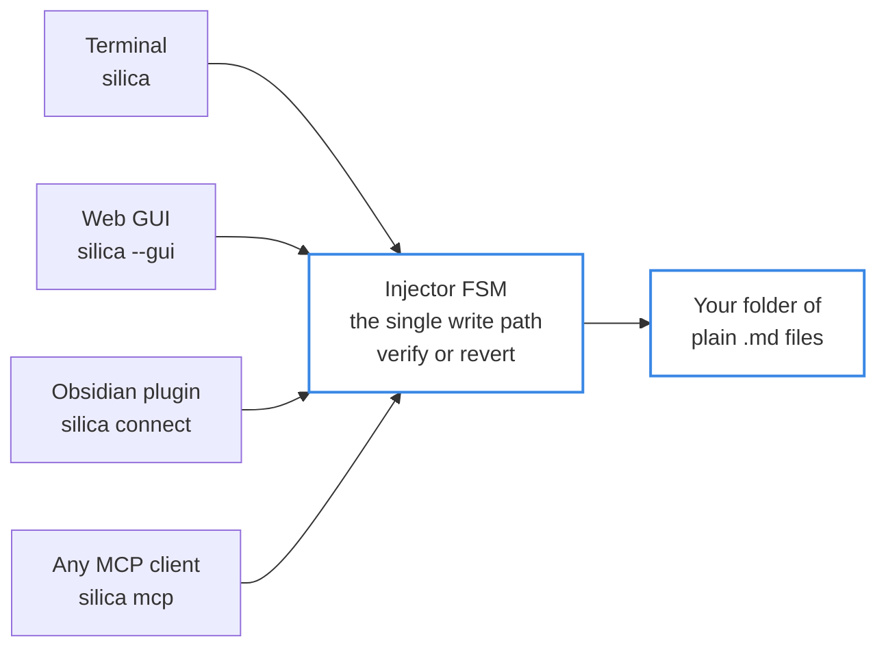
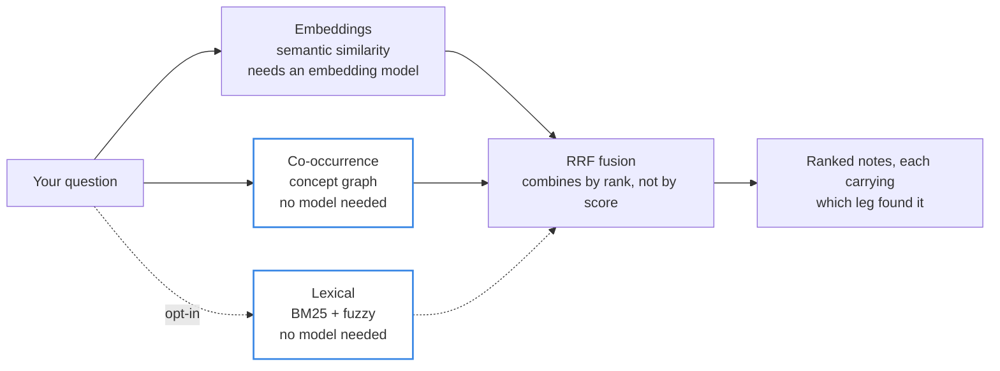
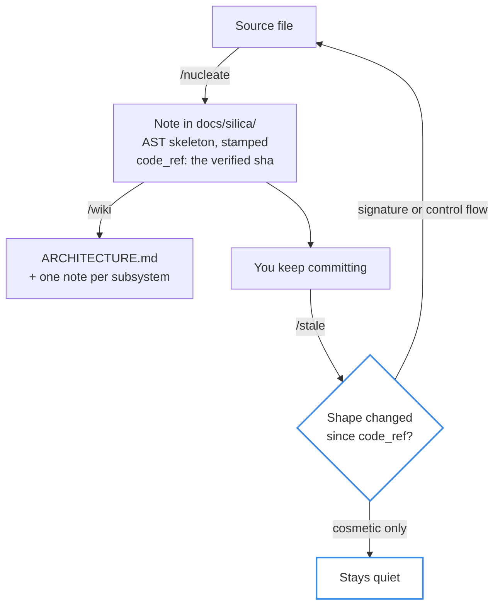

<p align="center">
  <picture>
    <source media="(prefers-color-scheme: light)" srcset="https://raw.githubusercontent.com/kiycoh/silica-agent/main/assets/banner-light.svg" />
    
  </picture>
</p>

<p align="center">
  <a href="https://pypi.org/project/silica-agent/"></a>
  <a href="https://pypi.org/project/silica-agent/"></a>
  <a href="https://github.com/kiycoh/silica-agent/releases"></a>
  <a href="https://github.com/kiycoh/silica-agent/blob/main/pyproject.toml#L13">=3.11" /></a>
  <br/>
  <a href="#readme"></a>
  <a href="#readme"></a>
  <a href="#readme"></a>
  <a href="https://obsidian.md"></a>
  <a href="LICENSE"></a>
</p>


<h3 align="center">Every other tool reads your notes.<br/>Silica is the one that answers for them.</h3>

<p align="center">
Point it at a folder of markdown or at a codebase. It grows the vault, links it, dedups it,<br/>
audits it, and answers from it. Every write it makes is re-read afterwards, and reverted if it<br/>
broke something. Local-first. Your files stay plain markdown, readable with or without it.
</p>

<p align="center">
  <b>78%</b> answerable accuracy and <b>~90%</b> correct refusals on LoCoMo &nbsp;·&nbsp;
  <b>100%</b> write integrity across a real 758-note vault<br/>
  <sub><a href="#measured">how these were measured</a></sub>
</p>

<p align="center">
  <a href="#why-silica">Why Silica</a> &nbsp;•&nbsp;
  <a href="#compared-to-the-alternatives">Compared</a> &nbsp;•&nbsp;
  <a href="#install">Install</a> &nbsp;•&nbsp;
  <a href="#four-ways-in">Drivers</a> &nbsp;•&nbsp;
  <a href="#what-you-can-do">Features</a> &nbsp;•&nbsp;
  <a href="#how-an-answer-is-grounded">Grounding</a> &nbsp;•&nbsp;
  <a href="#measured">Measured</a> &nbsp;•&nbsp;
  <a href="#point-it-at-code">Codebase</a> &nbsp;•&nbsp;
  <a href="#how-the-guardrail-works">Guardrails</a> &nbsp;•&nbsp;
  <a href="#command-reference">Commands</a> &nbsp;•&nbsp;
  <a href="#configuration">Config</a>
</p>

---

## Why Silica

### The problem

Two things go wrong the moment you give an assistant access to what you know.

**It answers from somewhere other than your material.** The model's own memory, a plausible paraphrase, a note that stopped being true a year ago. The answer reads the same either way, so you cannot tell which one you got.

**It edits your material and nobody checks the edit.** A merge orphans a note, a rewrite breaks a link, a cleanup flattens a distinction you cared about. Nothing fails loudly. You find out three weeks later, if at all.

**And it never has to live with the mess.** A vault decays on its own: the same idea captured five times, notes nothing points at any more, links to a file that moved, a subsystem documented against a commit from three months ago. An assistant that only reads has no stake in any of that.

The usual remedy makes all three worse: the tool copies your notes into a store of its own. Now the thing being answered from is not the thing on your disk, and you cannot open it to check.

Silica takes the opposite position. **The vault is the product, not the transcript.** Your folder of markdown is the database, Silica is answerable for the state it is in, and every write it makes passes a gate that re-reads what it just wrote.

🛡️ &nbsp;**A bad edit gets rolled back, not discovered later.**<br/>
Every write is re-read and checked after it lands. If it broke vault coherence, it is reverted automatically. If you simply changed your mind, `/undo` takes back one note and `/revert` takes back an entire run.

🧠 &nbsp;**Answers come from your material.**<br/>
Before answering, Silica reads the actual shape of your vault: its hubs, its clusters, and the notes nearest to your question. Contradictions between notes are surfaced, not smoothed over.

🌐 &nbsp;**Hidden connections surfaced visually.**<br/>
Silica calculates graph metrics to uncover structural hubs, bridge notes, and clusters. It links distant concepts that are hard to connect manually, surfacing them through interactive visual maps and graph audits.

💻 &nbsp;**It runs on your machine.**<br/>
Local models (LM Studio, Ollama) are first-class. With no embedding model at all, relatedness degrades to a deterministic local graph instead of failing.

📂 &nbsp;**Nothing is locked in.**<br/>
Your vault stays a folder of plain markdown files. Open it in Obsidian, in any editor, or in nothing at all. Silica is a layer on top, never a container around it.

<sub><b>New to this?</b> A "vault" is just a folder of markdown (<code>.md</code>) files. If you already use Obsidian, that folder is your Obsidian vault, and Silica works on it directly.</sub>

---

## Compared to the alternatives

> Everyone else either only reads your material, or owns a copy of it you cannot read. Silica is the one that treats your own file tree as the database, and puts a compiler-style gate in front of every change to it.

The two nearest neighbors are worth naming. [Basic Memory](https://github.com/basicmachines-co/basic-memory) is the substrate twin: markdown on your disk, wikilinks, MCP, same AGPL license. [LLM Wiki](https://github.com/nashsu/llm_wiki) is the closest in ambition: a desktop app that compiles your documents into a wiki and keeps it current.

| | **Silica** | **Basic Memory** | **LLM Wiki** |
| :--- | :--- | :--- | :--- |
| Where the knowledge lives | your folder of `.md` | your folder of `.md` | a generated `wiki/` of markdown, beside sources kept immutable |
| After a write lands | re-read and checked, reverted on mismatch | written, then indexed | a `Lint` pass on demand, plus a review queue for what the model flagged |
| Undoing a bad edit | `/undo` per note, `/revert` per run, optional git commit per write | your own version control; point-in-time restore is a paid cloud tier | not a documented feature; deleting a source cascades cleanup of the pages it produced |
| Merge, split, rename | incoming wikilinks redirected atomically, no orphan left behind | the file moves, the links pointing at it are yours to fix | dead wikilinks pruned when a source is deleted |
| With no model available | retrieval degrades to deterministic legs and keeps answering | keyword search stays, semantic needs an embedder | keyword and graph search stay, ingest needs an LLM |
| Codebases | same vault, same gate, staleness checked against git | notes only | documents only |
| Refusal rate published | yes, 94.4% and 89.7% correct abstention next to 78% accuracy | not published | not published |
| Hosting | local, AGPL, nothing above it | local AGPL, plus a paid cloud tier | local, GPL-3.0 desktop app |

**The rest of the field.** Memory agents (Mem0, Zep, Letta, Cognee, Supermemory) ingest your material into a store of their own; Letta is the only one with rollback, and none of them verifies a write after it lands. Repo wiki agents (DeepWiki, OpenWiki, GitNexus, [Graphify](https://github.com/safishamsi/graphify)) read a codebase and emit an artifact next to it: good maps, read-only by design, and they never curate a human's notes. Graph frameworks (GraphRAG, LightRAG, HippoRAG, Graphiti) build an index, not a folder you can still open in a text editor.

### What only Silica does

- **Verify or revert on the memory substrate itself.** 2026 produced an entire memory-poisoning literature proposing exactly this loop, stage the write, validate it, commit or roll back: Cordon, MOSS, MemLineage, MemAudit, SMSR. Every one of them is a research prototype. Silica ships the loop: one FSM entry point, a post-write re-read, an automatic revert on mismatch, `/undo` and `/revert` behind that. Read the [scope of the claim](#how-the-guardrail-works) before leaning on it.
- **A core that survives with no models at all.** The co-occurrence concept graph, the BM25 leg, and MinHash dedup need no embedder, and a leg with nothing useful to say abstains instead of poisoning the pool. Competitor cores are LLM-mandatory by construction, and the incentive runs that way: their business is the model call.
- **Notes and code as one substrate, behind one gate.** The split in the field is clean and nobody crosses it. Memory agents never touch a codebase; wiki agents never curate a human's notes.
- **Graph-safe mutation of links a human wrote.** Obsidian redirects links but has no agent driving it. Agents have no human link graph to keep intact. Silica has both.
- **Abstention as a published number.** Mem0's own 2026 benchmark write-up concedes the market underreports it. Silica prints correct refusals next to accuracy, and ships the [unflattering rows](#measured) unedited.

### What Silica did not invent

Credit where it is owed. Each of these arrived before Silica, and each is here because it earns its place, not because it is new:

- **Plain markdown, local-first, AGPL.** Basic Memory got there too, same license. It is the entry ticket to this category, and Silica pays it in full: no tier above the local one, no feature held back for a cloud plan.
- **A knowledge graph with community detection and an interactive view.** Graphify, GitNexus, LLM Wiki, and GraphRAG all ship one. What Silica adds is that the graph is not only a picture: the same co-occurrence structure is a retrieval leg, and it keeps working when there is no embedder.
- **Atomic notes that link themselves.** A-MEM's thesis, and Obsidian plugins have done it for years. The part that is Silica's is what happens next: those links survive a merge, a split, and a rename without leaving an orphan.
- **Noticing that documentation went stale against the code.** Fiberplane's Drift ships the same reformat-immune AST fingerprint, Swimm sells it, OpenWiki runs it on a schedule. Silica runs it inside the vault that also holds your notes, and `/impact`, from a diff back to the notes it invalidates, is the piece almost nobody replicates.
- **Typed relations between notes.** Graphiti has them, with per-edge validity intervals Silica does not model. Silica computes them on demand over notes you wrote, rather than freezing them into a store at ingest.
- **An MCP server and local models.** Table stakes, and Silica treats them as such: four drivers, one gate, no privileged client.

**On the numbers.** Silica does not claim state of the art, and the [figures below](#measured) say why: 2 of the 10 LoCoMo conversations, judged by a local-grade model. They are not comparable to what vendors report. They are something vendor numbers usually are not, which is re-runnable on your own machine, against the product path, with the harness in [`evals/`](evals/).

---

## Install

```bash
uv tool install silica-agent    # or: pipx install silica-agent
silica init                     # interactive setup: vault, model, embeddings
silica                          # start the interactive session
```

`silica` curates the folder you launch it in (the repository root, when that folder is inside one). Your settings live in `~/.silica/.env` and follow you between folders; a `.env` in the project overrides them there.

Make a read-only audit your first move. It writes nothing, and it shows you the hubs, bridges, and orphans already sitting in your vault:

```
/report
```

<details>
<summary><b>Optional features and development setup</b></summary>

<br/>

Extras install alone or combined, for example `'silica-agent[gui,mcp]'`:

```bash
uv tool install 'silica-agent[gui]'      # web GUI: silica --gui
uv tool install 'silica-agent[mcp]'      # MCP server: silica mcp
uv tool install 'silica-agent[connect]'  # Obsidian plugin bridge: silica connect
uv tool install 'silica-agent[pdf]'      # PDF nucleation
uv tool install 'silica-agent[rerank]'   # in-process cross-encoder rerank
uv tool install 'silica-agent[all]'      # everything above except dev
```

`[all]` inherits `[pdf]` and `[rerank]`, so it pulls torch and downloads several GB of model weights the first time those run.

Check your environment at any time with `silica doctor`. Add `--live` to send one tiny request that confirms the model really replies.

For development, clone and install editable instead (adds tests and linters), then prefix commands with `uv run`:

```bash
git clone https://github.com/kiycoh/silica-agent.git
cd silica-agent
uv pip install -e '.[dev]'
```

</details>

---

## Four ways in

One vault model, four drivers. What changes is who holds the write key.


```mermaid
flowchart LR
    T["Terminal<br/>silica"] --> FSM
    G["Web GUI<br/>silica --gui"] --> FSM
    O["Obsidian plugin<br/>silica connect"] --> FSM
    M["Any MCP client<br/>silica mcp"] --> FSM
    FSM["Injector FSM<br/>the single write path<br/>verify or revert"] --> V["Your folder of<br/>plain .md files"]

    style FSM fill:none,stroke:#3987e5,stroke-width:2px
    style V fill:none,stroke:#3987e5,stroke-width:2px
```

<sub>Four front doors, one gate. Switching driver changes the interface, never the rules a write has to pass.</sub>

### 1. Web GUI &nbsp;·&nbsp; `silica --gui`

A chat-first interface at `http://localhost:8765`. Query and curate from the browser, watch answers stream in, open the graph. Start here if you are new.


### 2. Terminal &nbsp;·&nbsp; `silica`

The interactive REPL. Every command in the [reference](#command-reference) lives here, and it is the fastest driver once you know the verbs.

### 3. Obsidian plugin &nbsp;·&nbsp; `silica connect`

A live bridge into the Obsidian desktop app: Silica reads and writes the vault you already have open, with rollback and cache behind every change, and every write shows up in a changes panel with a per-file diff. The plugin side lives in [kiycoh/obsidian-silica](https://github.com/kiycoh/obsidian-silica).

### 4. Agent memory &nbsp;·&nbsp; `silica mcp`

Silica serves your vault over stdio to any MCP client, so an assistant recalls your real notes and real decisions before it answers. One command line, `uvx --from 'silica-agent[mcp]' silica mcp`, wired three ways.

**Claude Code.** This repo is also a plugin, so the server and the recall/capture skill arrive together:

```bash
claude plugin marketplace add kiycoh/silica-agent
claude plugin install silica@silica
```

**Codex** (`~/.codex/config.toml`):

```toml
[mcp_servers.silica]
command = "uvx"
args = ["--from", "silica-agent[mcp]", "silica", "mcp"]

[mcp_servers.silica.env]
SILICA_VAULT = "/path/to/your/vault"
```

**opencode** (`opencode.json`):

```json
{
  "mcp": {
    "silica": {
      "type": "local",
      "command": ["uvx", "--from", "silica-agent[mcp]", "silica", "mcp"],
      "enabled": true,
      "environment": { "SILICA_VAULT": "/path/to/your/vault" }
    }
  }
}
```

`SILICA_VAULT` is optional: without it Silica serves the default vault at `~/.silica/vault`. An MCP client starts the server with its own environment, so any other setting the tools need (embedding endpoint, model) belongs in that same `env` block rather than in a shell profile.

---

## What you can do

**Clear an inbox without losing anything.**<br/>
Drop raw clippings, drafts, PDFs, or Jupyter Notebooks (`.ipynb`) in a folder. `/nucleate Inbox/*` distills each one into an atomic note, checks it against what you already have so you do not end up with a fifth copy of the same idea, and files it. Hand it twenty files at once and each one still goes through the same gate.

**Ask your notes instead of your memory.**<br/>
`/explain "<concept>"`, `/compare "A" "B"`, `/summarize <folder>`, `/quiz [note]`. All read-only, all grounded in the vault. Graded answers are logged, so untargeted `/quiz` draws from the notes you have missed before: what you did not know comes back, what you already knew does not.

**Visualize structure and schema.**<br/>
`/diagram "<topic>"` generates Mermaid flowcharts, mindmaps, sequence, or class diagrams. `/schematize "<topic>"` generates structured breakdown tables. Pass `--save=<path>` to persist them directly into your notes.

**Surface relationships and reading paths.**<br/>
`/relate <note>` builds a typed relationship matrix (prerequisite, elaborates, contradicts, sibling, depends-on) to neighboring notes. `/path "Note A" "Note B"` computes the shortest reading path across wikilinks and co-occurrence graphs.

**Track contested claims and project plans.**<br/>
`/contested` lists notes flagged with `contested: true` and their unresolved contradictions. `/plans` groups active project notes by status (`todo`, `in-progress`, `blocked`, `done`).

**Reorganize by intent.**<br/>
`/organize "group by project"` classifies and moves notes into a taxonomy. `/curate` plans autolink, dedup (embedder-free MinHash LSH), and cleanup work; `--apply` runs it. Staged batch transformations can be reviewed with `/review` and flushed safely.

**Refactor without breaking links.**<br/>
Merges and splits redirect every incoming link automatically, so a refactor leaves no broken reference and no orphan behind.

**Research straight into the vault.**<br/>
`/web-search "<topic>"` pulls cited findings into the inbox, reading the pages it finds rather than skimming snippets. `/fetch <url>` reads a single page (or a YouTube transcript) straight into the inbox. `/convert <file>` transcodes PDFs into Markdown drafts. Fetching is direct, with no third-party reader in the path, and nothing from the web reaches your notes until you nucleate it.

**When the vault does not have it.**<br/>
If every search a turn ran came back empty, Silica says so instead of answering thin, and names `/web`. Typing it is the consent: the answer comes from the web, with citations appended from the pages that were actually opened rather than from what the model claims it read. That turn writes nothing. `/keep` saves it to the inbox when it was worth keeping.

---

## How an answer is grounded

A question is not handed to one index and hoped for. It runs down independent legs, and the results are fused by rank:


```mermaid
flowchart LR
    Q["Your question"] --> E["Embeddings<br/>semantic similarity<br/>needs an embedding model"]
    Q --> C["Co-occurrence<br/>concept graph<br/>no model needed"]
    Q -. "opt-in" .-> L["Lexical<br/>BM25 + fuzzy<br/>no model needed"]
    E --> F["RRF fusion<br/>combines by rank, not by score"]
    C --> F
    L -.-> F
    F --> R["Ranked notes, each carrying<br/>which leg found it"]

    style C fill:none,stroke:#3987e5,stroke-width:2px
    style L fill:none,stroke:#3987e5,stroke-width:2px
```

Fusing by rank is what lets legs that measure nothing comparable sit in the same pool: a cosine and an unbounded BM25 score never have to agree on a scale. And a leg with nothing useful to say **abstains** rather than emitting a flat ranking that would poison the pool, so fusion degrades to whichever legs survived.

That is the whole reason the highlighted legs matter. They are deterministic and embedder-free, so with no embedding model at all, retrieval keeps working instead of failing. Each hit records its provenance, so an answer can name the note it came from.

The lexical leg is dotted because it is exactly that: optional. Build it with `/lexical` and it joins the same fusion, strong on the rare tokens, proper nouns, and dates that a semantic index is weakest on.

---

## Measured

Every number below comes from the harness in [`evals/`](evals/), run against the product path rather than a benchmark-only shortcut. Samples are small and the judge is a local-grade model, so read them as evidence you can re-run, not as leaderboard entries.

| What was measured | Result | Sample |
| :--- | :--- | :--- |
| **LoCoMo**, questions the memory can answer | **77.7%** and **78.0%** accuracy | conv-26 (152 q) and conv-47 (150 q) |
| **LoCoMo**, questions it should refuse | **94.4%** and **89.7%** correct abstention | 47 q and 40 q |
| **MuSiQue** multi-hop retrieval | **61.3%** recall@10, **0.83** MRR | 50 questions over an 11,654-note vault |
| **Link recall** on a real vault: wikilinks stripped, then recovered | **68.8%** of the human's own links found again | 1,196 links across 393 notes |
| **Fused retrieval** on the same vault, masked pairs | **77.6%** recall@10 | 522 pairs |
| **Write integrity** on the same vault | **100%** (758 of 758) notes where no write transform introduces a new structural violation | 758 notes |

**How they were run.** LoCoMo ingests two of the ten conversations through the production FSM (`fsm-extractive`) and answers them with the production agent loop, `deepseek-v4-flash` as both answer and judge model, retrieval top-10 through the `bge-reranker-v2-m3` cross-encoder. MuSiQue is retrieval only, no answer model, embeddings plus co-occurrence fused at k=10. The three vault rows are the deterministic tier of the golden harness against a live 758-note Obsidian vault, frozen in [`evals/golden/baseline.json`](evals/golden/baseline.json). Additional evaluation probes in [`evals/`](evals/) measure **FactScore** factual precision (`factscore.py`), claim span attribution (`probe_explain_spans.py`), **LongMemEval** long-memory retention, and paired statistical significance testing (`paired_stats.py`).

```bash
uv run python -m evals.golden --vault ~/path/to/vault
uv run python -m evals.musique --vault BENCH_DIR --corpus musique_corpus.json --questions musique.json --load --index
uv run python -m evals.locomo --data locomo10.json --run-root RUN_DIR \
  --conversations conv-26,conv-47 --ingest fsm-extractive --answer agent
```

**And the numbers that do not flatter.** The same frozen baseline reports 0.33 agreement between `/organize` and the folders the human had already chosen, and 0.11 recall for concept-expanded correlation. They ship unedited next to the good ones.

---

## See your vault

Both views render the structure your notes already have. Both run locally, and both work without an embedder: the deterministic co-occurrence graph still yields clusters and relatedness.

| View | What it gives you |
| :--- | :--- |
| **`/graph out.html`** | An interactive page: notes as nodes, links as edges, communities colored and named automatically so the clusters read at a glance. Opens in any browser, no server needed. |
| **`/map <note>`** | A radial mind-map grown out from a single note, written as `maps/<stem>.canvas` (opens natively in Obsidian) plus an SVG. Laid out by community so nodes never overlap. |

---

## Point it at code

Set `SILICA_VAULT` to a repository instead of a note folder and Silica keeps a human-readable map of the code under `docs/silica/`, kept honest against git.

- **`/nucleate <file>`** extracts a shallow AST skeleton with tree-sitter (signatures, structure, imports) and turns it into a markdown note, stamped with the commit it was verified against.
- **`/wiki`** grows that into a behavioral wiki: an `ARCHITECTURE.md` plus one note per subsystem.
- **`/stale`** flags notes whose source *changed in shape* since you documented it, meaning a signature or control-flow change rather than a reformat. **`/impact`** maps changed files to the notes they affect. You re-document what actually moved, not the whole tree.

The point is the loop, and git is what closes it:


```mermaid
flowchart TD
    SRC["Source file"] -- "/nucleate" --> N["Note in docs/silica/<br/>AST skeleton, stamped<br/>code_ref: the verified sha"]
    N -- "/wiki" --> W["ARCHITECTURE.md<br/>+ one note per subsystem"]
    N --> GIT["You keep committing"]
    GIT -- "/stale" --> D{"Shape changed<br/>since code_ref?"}
    D -- "cosmetic only" --> Q["Stays quiet"]
    D -- "signature or control flow" --> SRC

    style D fill:none,stroke:#3987e5,stroke-width:2px
    style Q fill:none,stroke:#3987e5,stroke-width:2px
```

<sub>A reformat is not a documentation debt. Only a real shape change is, and that is the difference `/stale` is built to make. `/impact` cuts the same question the other way: from a diff to the notes that document those files, plus their 1-hop neighbors.</sub>

One artifact, two readers: a human reads it as a current map of the repository, and a coding agent reads it over the [MCP server](#4-agent-memory--silica-mcp) to ground its work in the real structure instead of re-deriving it every session.

---

## How the guardrail works

You already let deterministic tools reject and rewrite your work every day. You do not trust those tools, you trust the guardrail they enforce. Silica puts an LLM's edits behind the same kind of guardrail:

| You already let a tool… | to guard against… | Silica does the same by… |
| :--- | :--- | :--- |
| a **compiler** reject source that will not build | syntax and type errors | an FSM refusing to commit a note that fails its structural checks |
| a **test suite** block a merge that breaks behavior | regressions | a post-write verify gate that reverts any edit which breaks vault coherence |
| **git** roll back a bad commit | losing history | `/undo` and `/revert` rolling back per note or per run |
| a **formatter** rewrite your code without asking | drift and inconsistency | graph-safe refactors that redirect links so a merge never orphans a note |

<p align="center">
  
</p>

### Design contracts

Silica is not a free-form agent. Every vault mutation passes through a finite-state machine that enforces these:

- **Single entry point.** All nucleation flows through the Injector FSM. There is no side channel that writes to the vault.
- **Verify or revert.** Every write is re-read and checked afterwards. A mismatch (`VerifyMismatchError`) rolls the write back.
- **Graph-safe moves.** Renames, merges, and splits redirect incoming links atomically. No operation leaves a broken reference or an orphan.
- **Zero-trust ingress.** External content such as web search results can only land in `Inbox/`. Nothing reaches the vault without explicit human staging and FSM review.
- **Layered rollback.** `/undo` (per note), `/revert` (per run), and optional `SILICA_GIT_COMMIT=auto` stack as independent safety nets.

<p align="center">
  
</p>

> **Scope of the claim.** The guardrail is enforced today on the normal write path. It is not yet crash-verified: a harness that kills the process mid-write to prove the invariants survive failure is [in progress](#status). Read it as enforced control flow, not as a proof under adversarial faults. Back your vault up before letting any tool rewrite it, and keep git as the byte-level backstop.

---

## Command reference

**Ask and audit** (read-only)

| Command | What it does |
| :--- | :--- |
| `/report [folder] [--embeddings] [--cooccurrence]` | Structural audit: hubs, bridges, orphans, autolink candidates |
| `/explain "<concept>" [--level=intro\|expert]` | Explain a concept grounded in the vault at the chosen register |
| `/summarize <note\|folder...>` | Read-only digest of one or more notes in chat |
| `/compare "A" "B"` | Comparison table; surfaces contradictions and contested notes |
| `/quiz [note\|folder] [--n=10]` | Active-recall quiz; misses resurface. No target = weak notes queue |
| `/relate <note> [--n=8]` | Typed relationship map (prerequisite, elaborates, contradicts, etc.) |
| `/path <noteA> <noteB>` | Shortest reading path between two notes (wikilinks + co-occurrence) |
| `/schematize <target> [--save=<path>]` | Breakdown table of a note, folder, or topic (optional note save) |
| `/diagram <target> [--save=<path>]` | Mermaid diagram (flowchart, mindmap, sequence, class, timeline) |
| `/contested` | List notes flagged `contested: true` with unresolved contradictions |
| `/find <query>` | Semantic search |

**Bring in and reshape**

| Command | What it does |
| :--- | :--- |
| `/nucleate <file...> [--target=DIR]` | Notes/PDFs/Notebooks via the gate; code as skeletons |
| `/organize "<intent>" [--scope=DIR] [--file=tax.yaml] [--apply]` | Classify and move notes into a taxonomy |
| `/curate [--apply]` · `/dedup` · `/refine` · `/enrich` | Plan and run autolink, MinHash LSH dedup, and enrichment |
| `/web [keywords]` | Answer from the web, cited from the pages opened; writes nothing. Bare `/web` re-asks your last question |
| `/keep` | Save the last `/web` answer as a cited note in the Inbox |
| `/web-search "<topic>" [--max-searches=N]` | Research on the web → cited findings note in Inbox |
| `/fetch <url>` | Read one page or YouTube transcript → verbatim note in Inbox |
| `/convert <file...>` | Transcode non-markdown files (PDFs) into markdown drafts |

**Indexes** `/embed` · `/cooccur` (embedder-free) · `/lexical` (BM25 and fuzzy)

**Visualize** `/graph [out.html]` · `/map <note>` (radial mind-map canvas)

**Codebase** `/wiki` · `/stale` · `/impact [<range>]`

**Undo, inspect, and queue**

| Command | What it does |
| :--- | :--- |
| `/undo [note]` | Undo the last patch on a note |
| `/revert [run-id]` | Revert a whole injection (per-run, LIFO) |
| `/status [run-id]` | Progress digest of the current/last batch run |
| `/review [--flush=HASH]` | Inspect or flush the async review queue (deferred operations) |
| `/plans` | List `plans/` notes grouped by status (`todo\|in-progress\|blocked\|done`) |

**System & Settings**

| Command | What it does |
| :--- | :--- |
| `/settings [<key> <value\|none>]` | View or edit `vault.yaml` settings without the wizard |
| `/vault [path]` | Show active vault or switch to another path for this session |
| `/help` · `/model` · `/tools` | Display help, current LLM model limits, or registered toolset |
| `/verbose` · `/thinking` · `/clear` · `/exit` | Cycle tool progress, toggle CoT reasoning, clear history, or exit |

---

## Configuration

`silica init` writes the essentials. The full list with defaults is in [`.env.example`](.env.example).

| Variable | Description |
| :--- | :--- |
| `SILICA_MODEL` | Chat model, litellm format (e.g. `openrouter/anthropic/claude-sonnet-4`) |
| `SILICA_PROVIDER` | `lmstudio` or `openrouter` |
| `SILICA_VAULT` | Vault path, adopted as-is. The working directory wins over this value unless it is exported in the environment (`SILICA_VAULT=... silica`, or an MCP client's `env` block). Reads cover the whole folder; writes are confined by `write_dir` in `vault.yaml` (a source tree declares `docs/silica`, a note folder writes in place) |
| `SILICA_EMBEDDING_MODEL` | Embedding model for semantic tasks (default `qwen3-embedding-4b`) |
| `SILICA_BACKEND` | `fs` (default, headless). The Obsidian bridge installs `ws` live at dial-in |
| `SILICA_GIT_COMMIT` | Git safety net for writes (`off`, `auto`) |
| `SILICA_TAVILY_API_KEY` | Optional: a backstop for `/web-search`, used only when DuckDuckGo rate-limits us. Search scrapes DuckDuckGo first either way, no key needed |
| `SILICA_WORKER_MODEL` | Sub-agent worker model, used for dedup and refinement |

---

## Status

Everything under **Available now** ships in the current release. Everything below it does not.

**Available now.** Note nucleation, structural audit, semantic and embedder-free search, graph-safe refactor / dedup / merge, graph and mind-map export, codebase skeletons with git-backed `/stale` and `/impact`, the code wiki, layered `/undo` and `/revert`, the git safety net, the MCP server, and the Claude Code plugin.

**Next, and it is the one that decides the rest.** Silica maintains the vault when you ask it to: `/curate`, `/organize`, `/stale`, `/report`. Being answerable for a folder means noticing without being asked, so scheduled upkeep is the next work: a watch on the folder, an audit that runs on its own, and a queue of changes waiting for your yes rather than surprising you with a diff. Until that ships, read the claim at the top of this file as on demand.

**In progress.** Richer codebase coverage across more languages, PDF/DOCX/TXT nucleation, the live Obsidian bridge, and the crash harness backing the guardrail.

**Planned.** Image nucleation, MCP packaging for non-Claude agents.

---

## References

* **[From Agent Loops to Structured Graphs: A Scheduler-Theoretic Framework for LLM Agent Execution](https://arxiv.org/abs/2604.11378)** (arXiv:2604.11378, 2026)
* **[Goal-Autopilot: A Verifiable Anti-Fabrication Firewall for Unattended Long-Horizon Agents](https://arxiv.org/abs/2606.11688)** (arXiv:2606.11688, 2026)
* **[Is Your Agent Playing Dead? Deployed LLM Agents Exhibit Constraint-Evasive Fabrication and Thanatosis](https://arxiv.org/abs/2606.14831)** (arXiv:2606.14831, 2026)
* **[Reliable Graph-RAG for Codebases: AST-Derived Graphs vs LLM-Extracted Knowledge Graphs](https://arxiv.org/abs/2601.08773)** (arXiv:2601.08773, 2026)
* **[Predicting new research directions in materials science using large language models and concept graphs](https://doi.org/10.1038/s42256-026-01206-y)** (*Nature Machine Intelligence*, 2026)

Silica's embedder-free near-duplicate detection (`/dedup`) is inspired by and ports the MinHash design from [Graphify](https://github.com/safishamsi/graphify).

---

## Contributing

Issues and pull requests welcome. See [CONTRIBUTING.md](CONTRIBUTING.md) for setup and conventions (English-only, conventional commits). By contributing you license your work under AGPL-3.0-or-later. For security issues follow [SECURITY.md](SECURITY.md) and do not open a public issue.

## License

**GNU Affero General Public License v3.0.** Strong copyleft. Incorporate any portion of Silica and that work becomes a derivative that must itself be AGPL-3.0, with complete corresponding source offered to everyone who uses it. **§13** extends this to network use: running a modified version as a hosted service obliges you to provide source to your users. There is no permissive fallback. See [LICENSE](LICENSE) for the full text.
