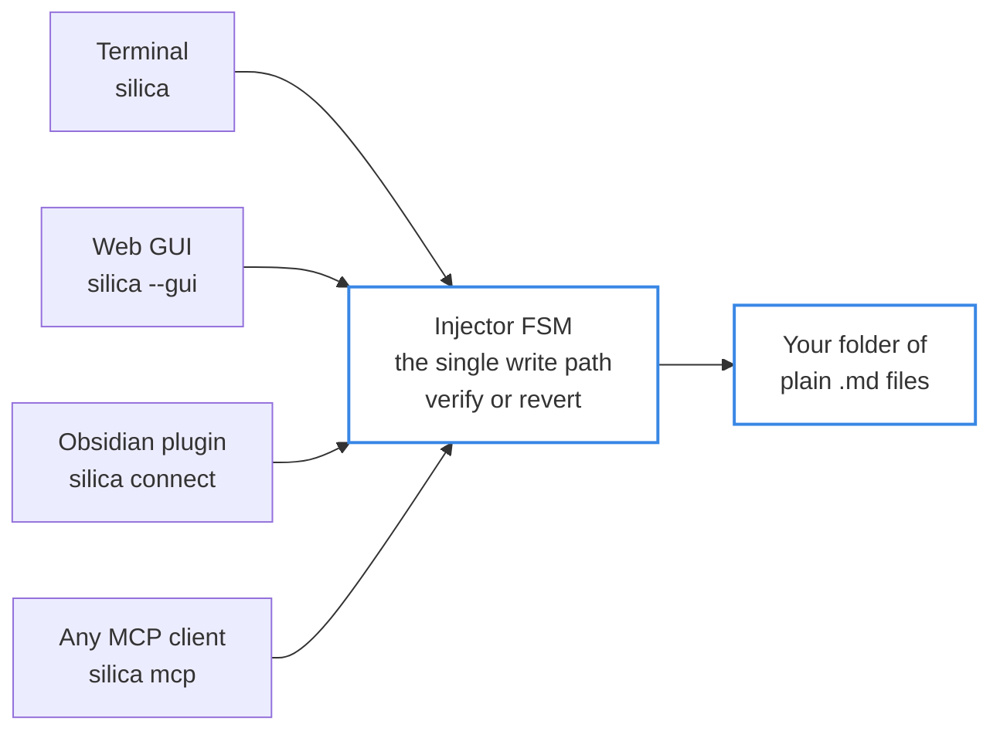
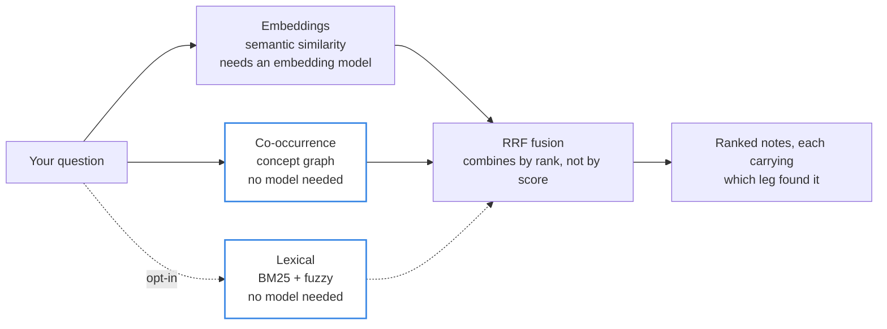
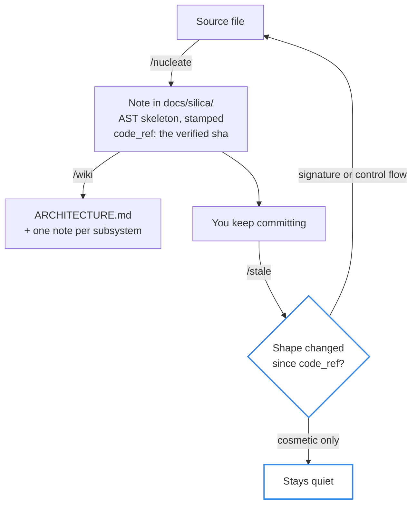

<p align="center">
  <picture>
    <source media="(prefers-color-scheme: light)" srcset="https://raw.githubusercontent.com/kiycoh/silica-agent/main/assets/banner-light.svg" />
    
  </picture>
</p>

<p align="center">
  <a href="https://www.python.org/"></a>
  <a href="https://obsidian.md/"></a>
  <a href="https://pypi.org/project/silica-agent/"></a>
  <a href="https://opensource.org/licenses/AGPL-3.0"></a>
</p>

<h3 align="center">Point Silica at a folder of notes or at a codebase.<br/>Ask it anything. Every write is verified or reverted.</h3>

<p align="center">
It answers from what you <i>actually</i> have instead of guessing, and it re-reads every edit it makes to<br/>
confirm the edit held. Local-first. Your files stay plain markdown, readable with or without it.
</p>

<p align="center">
  <a href="#why-silica">Why Silica</a> &nbsp;•&nbsp;
  <a href="#install">Install</a> &nbsp;•&nbsp;
  <a href="#four-ways-in">Drivers</a> &nbsp;•&nbsp;
  <a href="#what-you-can-do">Features</a> &nbsp;•&nbsp;
  <a href="#how-an-answer-is-grounded">Grounding</a> &nbsp;•&nbsp;
  <a href="#point-it-at-code">Codebase</a> &nbsp;•&nbsp;
  <a href="#how-the-guardrail-works">Guardrails</a> &nbsp;•&nbsp;
  <a href="#command-reference">Commands</a> &nbsp;•&nbsp;
  <a href="#configuration">Config</a>
</p>

---

## Why Silica

Most "chat with your notes" tools hand a free-running agent the keys and hope for the best. The damage is quiet: a merge orphans a note, a rewrite breaks a link, and you find out three weeks later. Silica is built the other way around.

🛡️ &nbsp;**A bad edit gets rolled back, not discovered later.**<br/>
Every write is re-read and checked after it lands. If it broke vault coherence, it is reverted automatically. If you simply changed your mind, `/undo` takes back one note and `/revert` takes back an entire run.

🧠 &nbsp;**Answers come from your material.**<br/>
Before answering, Silica reads the actual shape of your vault: its hubs, its clusters, and the notes nearest to your question. Contradictions between notes are surfaced, not smoothed over.

🌐 &nbsp;**Hidden connections surfaced visually.**<br/>
Silica calculates graph metrics to uncover structural hubs, bridge notes, and clusters. It links distant concepts that are hard to connect manually, surfacing them through interactive visual maps and graph audits.

💻 &nbsp;**It runs on your machine.**<br/>
Local models (LM Studio, Ollama) are first-class. With no embedding model at all, relatedness degrades to a deterministic local graph instead of failing.

📂 &nbsp;**Nothing is locked in.**<br/>
Your vault stays a folder of plain markdown files. Open it in Obsidian, in any editor, or in nothing at all. Silica is a layer on top, never a container around it.

<sub><b>New to this?</b> A "vault" is just a folder of markdown (<code>.md</code>) files. If you already use Obsidian, that folder is your Obsidian vault, and Silica works on it directly.</sub>

---

## Install

```bash
uv tool install silica-agent    # or: pipx install silica-agent
silica init                     # interactive setup: vault, model, embeddings
silica                          # start the interactive session
```

Make a read-only audit your first move. It writes nothing, and it shows you the hubs, bridges, and orphans already sitting in your vault:

```
/report
```

<details>
<summary><b>Optional features and development setup</b></summary>

<br/>

Extras install alone or combined, for example `'silica-agent[gui,mcp]'`:

```bash
uv tool install 'silica-agent[gui]'      # web GUI: silica --gui
uv tool install 'silica-agent[mcp]'      # MCP server: silica mcp
uv tool install 'silica-agent[connect]'  # Obsidian plugin bridge: silica connect
uv tool install 'silica-agent[pdf]'      # PDF nucleation
uv tool install 'silica-agent[rerank]'   # in-process cross-encoder rerank
uv tool install 'silica-agent[all]'      # everything above except dev
```

`[all]` inherits `[pdf]` and `[rerank]`, so it pulls torch and downloads several GB of model weights the first time those run.

Check your environment at any time with `silica doctor`. Add `--live` to send one tiny request that confirms the model really replies.

For development, clone and install editable instead (adds tests and linters), then prefix commands with `uv run`:

```bash
git clone https://github.com/kiycoh/silica-agent.git
cd silica-agent
uv pip install -e '.[dev]'
```

</details>

---

## Four ways in

One vault model, four drivers. What changes is who holds the write key.


```mermaid
flowchart LR
    T["Terminal<br/>silica"] --> FSM
    G["Web GUI<br/>silica --gui"] --> FSM
    O["Obsidian plugin<br/>silica connect"] --> FSM
    M["Any MCP client<br/>silica mcp"] --> FSM
    FSM["Injector FSM<br/>the single write path<br/>verify or revert"] --> V["Your folder of<br/>plain .md files"]

    style FSM fill:none,stroke:#3987e5,stroke-width:2px
    style V fill:none,stroke:#3987e5,stroke-width:2px
```

<sub>Four front doors, one gate. Switching driver changes the interface, never the rules a write has to pass.</sub>

### 1. Web GUI &nbsp;·&nbsp; `silica --gui`

A chat-first interface at `http://localhost:8765`. Query and curate from the browser, watch answers stream in, open the graph. Start here if you are new.


### 2. Terminal &nbsp;·&nbsp; `silica`

The interactive REPL. Every command in the [reference](#command-reference) lives here, and it is the fastest driver once you know the verbs.


### 3. Obsidian plugin &nbsp;·&nbsp; `silica connect`

A live bridge into the Obsidian desktop app: Silica reads and writes the vault you already have open, with rollback and cache behind every change, and every write shows up in a changes panel with a per-file diff. The plugin side lives in [kiycoh/obsidian-silica](https://github.com/kiycoh/obsidian-silica).


### 4. Agent memory &nbsp;·&nbsp; `silica mcp`

Silica serves your vault over stdio to any MCP client, so an assistant recalls your real notes and real decisions before it answers. For Claude Code, this repo is also a plugin:

```bash
claude plugin marketplace add /path/to/silica-agent
claude plugin install silica@silica
```


---

## What you can do

**Clear an inbox without losing anything.**<br/>
Drop raw clippings and drafts in a folder. `/nucleate Inbox/*.md` distills each one into an atomic note, checks it against what you already have so you do not end up with a fifth copy of the same idea, and files it. Hand it twenty files at once and each one still goes through the same gate.

**Ask your notes instead of your memory.**<br/>
`/explain "<concept>"`, `/compare "A" "B"`, `/summarize <folder>`, `/quiz <note>`. All read-only, all grounded in the vault.

**Reorganize by intent.**<br/>
`/organize "group by project"` classifies and moves notes into a taxonomy. `/curate` plans the autolink, dedup, and cleanup work; `--apply` runs it.

**Refactor without breaking links.**<br/>
Merges and splits redirect every incoming link automatically, so a refactor leaves no broken reference and no orphan behind.

**Research straight into the vault.**<br/>
`/web-search "<topic>"` pulls cited findings into the inbox. Nothing from the web reaches your notes until you nucleate it.

---

## How an answer is grounded

A question is not handed to one index and hoped for. It runs down independent legs, and the results are fused by rank:


```mermaid
flowchart LR
    Q["Your question"] --> E["Embeddings<br/>semantic similarity<br/>needs an embedding model"]
    Q --> C["Co-occurrence<br/>concept graph<br/>no model needed"]
    Q -. "opt-in" .-> L["Lexical<br/>BM25 + fuzzy<br/>no model needed"]
    E --> F["RRF fusion<br/>combines by rank, not by score"]
    C --> F
    L -.-> F
    F --> R["Ranked notes, each carrying<br/>which leg found it"]

    style C fill:none,stroke:#3987e5,stroke-width:2px
    style L fill:none,stroke:#3987e5,stroke-width:2px
```

Fusing by rank is what lets legs that measure nothing comparable sit in the same pool: a cosine and an unbounded BM25 score never have to agree on a scale. And a leg with nothing useful to say **abstains** rather than emitting a flat ranking that would poison the pool, so fusion degrades to whichever legs survived.

That is the whole reason the highlighted legs matter. They are deterministic and embedder-free, so with no embedding model at all, retrieval keeps working instead of failing. Each hit records its provenance, so an answer can name the note it came from.

The lexical leg is dotted because it is exactly that: optional. Build it with `/lexical` and it joins the same fusion, strong on the rare tokens, proper nouns, and dates that a semantic index is weakest on.

---

## See your vault

Both views render the structure your notes already have. Both run locally, and both work without an embedder: the deterministic co-occurrence graph still yields clusters and relatedness.

| View | What it gives you |
| :--- | :--- |
| **`/graph out.html`** | An interactive page: notes as nodes, links as edges, communities colored and named automatically so the clusters read at a glance. Opens in any browser, no server needed. |
| **`/map <note>`** | A radial mind-map grown out from a single note, written as `maps/<stem>.canvas` (opens natively in Obsidian) plus an SVG. Laid out by community so nodes never overlap. |

---

## Point it at code

Set `SILICA_VAULT` to a repository instead of a note folder and Silica keeps a human-readable map of the code under `docs/silica/`, kept honest against git.

- **`/nucleate <file>`** extracts a shallow AST skeleton with tree-sitter (signatures, structure, imports) and turns it into a markdown note, stamped with the commit it was verified against.
- **`/wiki`** grows that into a behavioral wiki: an `ARCHITECTURE.md` plus one note per subsystem.
- **`/stale`** flags notes whose source *changed in shape* since you documented it, meaning a signature or control-flow change rather than a reformat. **`/impact`** maps changed files to the notes they affect. You re-document what actually moved, not the whole tree.

The point is the loop, and git is what closes it:


```mermaid
flowchart TD
    SRC["Source file"] -- "/nucleate" --> N["Note in docs/silica/<br/>AST skeleton, stamped<br/>code_ref: the verified sha"]
    N -- "/wiki" --> W["ARCHITECTURE.md<br/>+ one note per subsystem"]
    N --> GIT["You keep committing"]
    GIT -- "/stale" --> D{"Shape changed<br/>since code_ref?"}
    D -- "cosmetic only" --> Q["Stays quiet"]
    D -- "signature or control flow" --> SRC

    style D fill:none,stroke:#3987e5,stroke-width:2px
    style Q fill:none,stroke:#3987e5,stroke-width:2px
```

<sub>A reformat is not a documentation debt. Only a real shape change is, and that is the difference `/stale` is built to make. `/impact` cuts the same question the other way: from a diff to the notes that document those files, plus their 1-hop neighbors.</sub>

One artifact, two readers: a human reads it as a current map of the repository, and a coding agent reads it over the [MCP server](#4-agent-memory--silica-mcp) to ground its work in the real structure instead of re-deriving it every session.

---

## How the guardrail works

You already let deterministic tools reject and rewrite your work every day. You do not trust those tools, you trust the guardrail they enforce. Silica puts an LLM's edits behind the same kind of guardrail:

| You already let a tool… | to guard against… | Silica does the same by… |
| :--- | :--- | :--- |
| a **compiler** reject source that will not build | syntax and type errors | an FSM refusing to commit a note that fails its structural checks |
| a **test suite** block a merge that breaks behavior | regressions | a post-write verify gate that reverts any edit which breaks vault coherence |
| **git** roll back a bad commit | losing history | `/undo` and `/revert` rolling back per note or per run |
| a **formatter** rewrite your code without asking | drift and inconsistency | graph-safe refactors that redirect links so a merge never orphans a note |

<p align="center">
  
</p>

### Design contracts

Silica is not a free-form agent. Every vault mutation passes through a finite-state machine that enforces these:

- **Single entry point.** All nucleation flows through the Injector FSM. There is no side channel that writes to the vault.
- **Verify or revert.** Every write is re-read and checked afterwards. A mismatch (`VerifyMismatchError`) rolls the write back.
- **Graph-safe moves.** Renames, merges, and splits redirect incoming links atomically. No operation leaves a broken reference or an orphan.
- **Zero-trust ingress.** External content such as web search results can only land in `Inbox/`. Nothing reaches the vault without explicit human staging and FSM review.
- **Layered rollback.** `/undo` (per note), `/revert` (per run), and optional `SILICA_GIT_COMMIT=auto` stack as independent safety nets.

<p align="center">
  
</p>

> **Scope of the claim.** The guardrail is enforced today on the normal write path. It is not yet crash-verified: a harness that kills the process mid-write to prove the invariants survive failure is [in progress](#status). Read it as enforced control flow, not as a proof under adversarial faults. Back your vault up before letting any tool rewrite it, and keep git as the byte-level backstop.

---

## Command reference

**Ask and audit** (read-only)

| Command | What it does |
| :--- | :--- |
| `/report [folder]` | Structural audit: hubs, bridges, orphans |
| `/explain "<concept>" [--level]` | Explain a concept, grounded in the vault |
| `/summarize <note\|folder>` | Digest of one or more notes |
| `/compare "A" "B"` | Comparison table, surfaces contradictions |
| `/quiz <note> [--n=10]` | Active-recall quiz from your notes |
| `/relate <note>` · `/path A B` | How notes relate · shortest reading path |
| `/schematize <target>` · `/diagram <target>` | Table · Mermaid diagram of a note, folder, or topic |
| `/find <query>` | Semantic search |

**Bring in and reshape**

| Command | What it does |
| :--- | :--- |
| `/nucleate <file...> [--target=DIR]` | Notes via the gate; code as skeletons |
| `/organize "<intent>" [--apply]` | Classify and move notes into a taxonomy |
| `/curate [--apply]` · `/dedup` · `/refine` · `/enrich` | Plan and run autolink, dedup, enrichment |
| `/web-search "<topic>"` | Cited web findings into the inbox |
| `/convert <file>` | Transcode a PDF into a markdown draft |

**Indexes** `/embed` · `/cooccur` (embedder-free) · `/lexical` (BM25 and fuzzy)

**Visualize** `/graph [out.html]` · `/map <note>`

**Codebase** `/wiki` · `/stale` · `/impact [<range>]`

**Undo and inspect** `/undo [note]` · `/revert [run]` · `/status` · `/review` · `/plans` · `/contested`

**System** `/help` · `/model` · `/vault [path]` · `/settings [<key> <value>]` · `/tools` · `/verbose` · `/thinking` · `/clear` · `/exit`

---

## Configuration

`silica init` writes the essentials. The full list with defaults is in [`.env.example`](.env.example).

| Variable | Description |
| :--- | :--- |
| `SILICA_MODEL` | Chat model, litellm format (e.g. `openrouter/anthropic/claude-sonnet-4`) |
| `SILICA_PROVIDER` | `lmstudio` or `openrouter` |
| `SILICA_VAULT` | Vault path, adopted as-is. Reads cover the whole folder; writes are confined by `write_dir` in `vault.yaml` (a source tree declares `docs/silica`, a note folder writes in place) |
| `SILICA_EMBEDDING_MODEL` | Embedding model for semantic tasks (default `qwen3-embedding-4b`) |
| `SILICA_BACKEND` | `fs` (default, headless). The Obsidian bridge installs `ws` live at dial-in |
| `SILICA_GIT_COMMIT` | Git safety net for writes (`off`, `auto`) |
| `SILICA_TAVILY_API_KEY` | Enables `/web-search` |
| `SILICA_WORKER_MODEL` | Sub-agent worker model, used for dedup and refinement |

---

## Status

Everything under **Available now** ships in the current release. Everything below it does not.

**Available now.** Note nucleation, structural audit, semantic and embedder-free search, graph-safe refactor / dedup / merge, graph and mind-map export, codebase skeletons with git-backed `/stale` and `/impact`, the code wiki, layered `/undo` and `/revert`, the git safety net, the MCP server, and the Claude Code plugin.

**In progress.** Richer codebase coverage across more languages, PDF/DOCX/TXT nucleation, the live Obsidian bridge, and the crash harness backing the guardrail.

**Planned.** Image nucleation, MCP packaging for non-Claude agents.

---

## References

* **[From Agent Loops to Structured Graphs: A Scheduler-Theoretic Framework for LLM Agent Execution](https://arxiv.org/abs/2604.11378)** (arXiv:2604.11378, 2026)
* **[Goal-Autopilot: A Verifiable Anti-Fabrication Firewall for Unattended Long-Horizon Agents](https://arxiv.org/abs/2606.11688)** (arXiv:2606.11688, 2026)
* **[Is Your Agent Playing Dead? Deployed LLM Agents Exhibit Constraint-Evasive Fabrication and Thanatosis](https://arxiv.org/abs/2606.14831)** (arXiv:2606.14831, 2026)
* **[Reliable Graph-RAG for Codebases: AST-Derived Graphs vs LLM-Extracted Knowledge Graphs](https://arxiv.org/abs/2601.08773)** (arXiv:2601.08773, 2026)
* **[Predicting new research directions in materials science using large language models and concept graphs](https://doi.org/10.1038/s42256-026-01206-y)** (*Nature Machine Intelligence*, 2026)

Silica's embedder-free near-duplicate detection (`/dedup`) is inspired by and ports the MinHash design from [Graphify](https://github.com/safishamsi/graphify).

---

## Contributing

Issues and pull requests welcome. See [CONTRIBUTING.md](CONTRIBUTING.md) for setup and conventions (English-only, conventional commits). By contributing you license your work under AGPL-3.0-or-later. For security issues follow [SECURITY.md](SECURITY.md) and do not open a public issue.

## License

**GNU Affero General Public License v3.0.** Strong copyleft. Incorporate any portion of Silica and that work becomes a derivative that must itself be AGPL-3.0, with complete corresponding source offered to everyone who uses it. **§13** extends this to network use: running a modified version as a hosted service obliges you to provide source to your users. There is no permissive fallback. See [LICENSE](LICENSE) for the full text.
